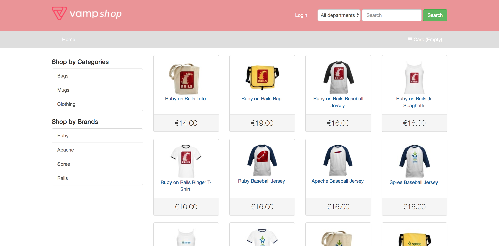

# Advanced Tutorial

in this section we want to better showcase what Vamp Kubist and Istio can do.   
In order to do so we will set up an entire environment with multiple virtual clusters and deployments.  
The final goal of this example is shown in the image below.


As you can see, at the end of this tutorial you will have three virtual clusters, two of them on a cluster and the third one on another cluster.    
Each one of the virtual cluster will have its own deployments and a different networking infrastructure.

## Requirements

At least two clusters and a vamp installation.
The [setup section](SETUP.md) can help you with creating the two necessary clusters.
You can either use cluster default and cluster1 as the two clusters or add a new cluster2.

## Setting up the environment

The first step is to set up the virtual clusters and deployments on on the first cluster, which will be called cluster1 in the rest of the tutorial. 
You can quickly do that by applying the [cluster1-setup.yaml](samples/full-example-setup.yaml) with the command:

```shell
kubectl apply -f https://raw.githubusercontent.com/magneticio/vampkubistdocs/master/samples/advanced-tutorial/cluster1-setup.yaml
```

After running the command, by running 

```shell
vamp list virtualclusters
```

you should get the following response.

```shell
- kubist-test1
- kubist-test2
```

As you can see the virtual clusters have all been imported and you will be able to see the applications and the deployments they contain by running

```shell
vamp list applications -r kubist-test1

vamp list applications -r kubist-test2

```

Let's now focus on virtual cluster kubist-test1, so first of all select it with

```shell
vamp config set -r kubist-test1
```

The next step is to create a new destination for application app1.

```shell
vamp create destination dest-app-1 -f https://raw.githubusercontent.com/magneticio/vampkubistdocs/master/samples/advanced-tutorial/dest-app-1.yaml
```

where the yaml content is

```yaml
application: app1
ports:
  - name: http
    port: 9191
    targetPort: 9191
    protocol: TCP
subsets:
  subset1:
    labels:
      deployment: deployment1
  subset2:
    labels:
      deployment: deployment2
  subset3:
    labels:
      deployment: deployment3
```

Now you can set up a gateway to expose the Service you just created to the outside.  
**For this example to work properly you need to define your own hostnames for the gateways you are going to create.**
So, choose two hostnames and specify them in the gateway configuration as shown below.

```shell
vamp create gateway gw-app1 -f ./yourgateway.yaml
```

The configuraiton you are going to use will look like this

```yaml
servers:
  - port: 80
    protocol: http
    hosts:
      - gw-app1-1.democluster.net
      - gw-app1-2.democluster.net
```      

As you can see the specification contains two different hostnames that we will use in the udnerlying vamp services.
If you already followed the [setup section](SETUP.md), then the host name you specified will be associated, ater a short time, with you gateway's ip.   
Otherwise we recommend you take a look at that section in order to set up the google credentials necessary to manage the hostsnames through Google DNS.

Now that the gateway is setup you need only create a vamp service in order to finally be able to access the application.    
To do that, use the following run

```shell
vamp create vampservice vs-app1-1 -f ./yourvampservice.yaml
```

Below you can take a look at the configuration you are going to submit.

```yaml
gateways:
  - gw-app1
hosts:
  - gw-app1-1.democluster.net
routes:
  - protocol: http
    weights:
      - destination: dest-app-1
        port: 9191
        version: subset1
        weight: 100
exposeInternally: true
```

**Again, take care to specify one of the hostnames you defined in the gateway and not the one used in the example.**

Shortly after submitting you will be able to access application app1 using your hostname of choice.
Let's map also the other hostname, using a second vamp service vs-app1-2 with the following specificaiton

```shell
gateways:
  - gw-app1
hosts:
  - gw-app1-2.democluster.net
routes:
  - protocol: http
    weights:
      - destination: dest-app-1
        port: 9191
        version: subset2
        weight: 100
exposeInternally: true
```

Now, if you try calling the second hostname you will be sent to subset2 in the Service you created.
At this point in the tutorial you succesfully mapped two hostnames to two separate subsets of a Service and are able to send requests to them from outside the Cluster.
If you call gw-app1-1.democluster.net, or rather the real hostname you specified, from your browser this is what you will see



while calling gw-app1-2.democluster.net you will land on subset2 and be presented with


Having done that, let's try something else.
Switch to the kubist-test2 virtual cluster containing application app2.

```shell
vamp config set -r kubist-test2
```

This time you are going to create a single vamp service that will respond to a single hostname and that will dispatch requests to either app1 subset3 or app2 subset1.
Dispatching of the requests will be regulated by the url invoked and the url itself will be rewritten before making the actual call to the Service itself.
Let's start with the easy stuff, that is creating destination dest-app-2 and gateway gw-app2 by using the following specificaitons.

Destination:

```yaml
application: app2
ports:
  - name: http
    port: 9191
    targetPort: 9191
    protocol: TCP
subsets:
  subset1:
    labels:
      deployment: deployment1
  subset2:
    labels:
      deployment: deployment2
  subset3:
    labels:
      deployment: deployment3
```

Gateway:

```yaml
servers:
  - port: 80
    protocol: http
    hosts:
      - gw-app2-1.democluster.net
``` 

As you can see the setup is basically identical to what we did in virtual cluster kubist-test1. The only significant difference is that we need to use a new hostname for the gateway definition.
Let's now create vamp service vs-app2-1.
The vamp service should dispatch requests starting with '/service1' to app1 subset3 and requests starting with '/service2' to app2 subset1. At the same time those url should be rewritten to a simple '/'. 
If we were to skip this last step, the request would fail.
In order to achieve all that, you need to define two conditional routes with the following conditions:

```shell
uri prefix "/service1"
```

```shell
uri prefix "/service2"
```

and also specify the value '/' in the rewrite field.
Worthy of note is the fact that, since app1 resides in a different virtual cluster, we have to use its fully qualified name to be able to reach it, that is dest-app-1.kubist-test1.svc.cluster.local.
For reference you can find the full configuration below.

```yaml
gateways:
  - gw-app1
hosts:
  - app1.democluster.net
routes:
  - condition: uri prefix "/service1"
    rewrite: "/"
    protocol: http
    weights:
      - destination: dest-app-1.kubist-test1.svc.cluster.local
        port: 9191
        version: subset3
        weight: 100
  - condition: uri prefix "/service2"
    rewrite: "/"
    protocol: http
    weights:
      - destination: dest-app-2
        port: 9191
        version: subset1
        weight: 100
exposeInternally: true
```

If you try now to send requests to the specified hostname with the appropriate url you will be redirected to the correct application.
**Please note that there's currently a bug with the demo app paths not being elative, that will cause the page not to be displayed correctly**
Our work with kubist-test2 is finished, let's now focus on the last virtual cluster: kubist-test3.

Let's first move on the second cluster, which we will call cluster2.
Now we need to set up the virtual cluster by running.

```shell
kubectl apply -f https://raw.githubusercontent.com/magneticio/vampkubistdocs/master/samples/advanced-tutorial/cluster2-setup.yaml
```

In this virtual cluster, as shown in the initial graph, we want to bw able to access hostname gw-app2-1.democluster.net from a pod inside the virtual cluster.
However, hostname gw-app2-1.democluster.net is outside cluster2 and external services are normally not reachable from pods belonging to the Istio Mesh, hence we have to somehow make the host defined on gateway gw-app2 accessible.    
Service entries are an Istio resource that can do just that.
We are thus going to create one of them with name ex-svc-1 this configuration.

```yaml
hosts:
  - gw-app2-1.democluster.net
ports:
  - port: 80
    protocol: http 
```
 
By using kubectl to log into one of the pods running into the kubist-test3 namespace you will now be able to send requests to gateway gw-app2-1.democluster.net going outside the cluster, like this:

````
curl http://gw-app2-1.democluster.net/service1
````

where gw-app2-1.democluster.net should be replaced by the hostname you defined previously.
Thanks to the service entry you can now also add a vmap service definition that references the external service and use it to define timeouts or retry policies as shown in the configuration below.

```yaml
gateways:
hosts:
  - gw-app2-1.democluster.net
routes:
  - protocol: http
    retries:
      attempts: 5
      timeout: 3
    weights:
      - destination: gw-app2-1.democluster.net
        weight: 100
exposeInternally: true
```

This concludes the tutorial, but feel free to keep on experimenting on the environment you just created; it makes for a good foundation to try different setups and explore the available configuration options.
